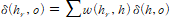
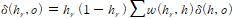
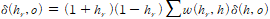
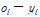
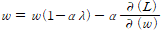

# 1. 신경망기초

## 1.1 신경망이란

- 다변수 최적화 문제
- 역전파 알고리즘으로 갱신(경사하강법)

### 1.1.1 역전파

- 동일 입력층에 대해 원하는 값이 출력되도록 개개의 weight를 조정하는 방법으로 사용
- 설정의 작은 변화에 민감 => 초기점 선택이 중요(국소해 문제 등)
- 단순히 구현하면 자원소모가 매우 큼 => DP+Chain rule으로 해결
  - 다변량 연쇄법칙으로 경로조합을 갱신 ~ classic은 개별 갱신/신경망에서는 DP로 계산 복잡도를 선형으로 줄여서 사용

### 1.1.2 간단한 갱신 공식

- linear:  

- sigmoid:   

- tanh:   
- relu: 조건부 linear
- softmax:   
  - 대부분의 경우 출력층에 활용되고, categorical_crossentropy를 활용한다는 사실을 이요한 트릭
- ** delta: 오차 값, h_r은 활성화 이후 출력 값

### 1.1.3 Optimizer

- 경사하강법을 효율적이게 하기 위한 전략
- SGD, Adam, AdaDelta 등
- 간한 정보는 [여기](https://github.com/young31/Deep-Learning/blob/master/optimizer/optimizer.md) 참조

## 1.2 모형구성시 유의사항

### 1.2.1 분산 편향 trade-off

- 쉽게 생각하면 분산은 정밀도, 편향은 정확도의 느낌
- 분산이 커지면 모형의 robustness가 감소
- 편향은 모형의 가정단순화로 인한 오류
- ** 퍼센트론(신경망)에서 매개변수가 많아지면 분산이 커짐!!

### 1.2.2 모형평가

- 일반적으로 CV, hold-out 법이 있음
- 모형 구성시 시간복잡도를 고려하여 선택
- ** 일반적으로 신경망모형은 적합시 오래걸리므로 hold-out방법이 선호 됨

### 1.2.3 정칙화 전략(L2)

- 손실함수에 가중치의 제곱값을 더해줌
- 복잡한 모형 + 정칙화 가 단순한 모형보다 낫다는 연구결과
- 잡음추가(섭동 등)의 효과를 낼 수 있음
-    식으로 갱신 (lambda가 l2계수)
- cf) l1은 특수목적으로 사용

## 1.3 모형 구성 기술

### 1.3.1 앙상블

- 앙상블방법으로 대표적으로 bagging, boosting
  - bagging => 분산 감소 효과 / boosting => 편향 감소 효과
- 신경망의 앙상블 목적이 분산을 감소시키는 것을 고려하면 bagging전략이 메인 관심사

### 1.3.2 Dropout

- 무작위로 일정 비율만큼의 가중치를 생략
- 특징 공적응(feature co-adaption)방지 효과
- bagging과 유사한 효과 기대 가능
- ** 특징 공적응: 앞쪽에서 잘못 결정된 값으로 인해 뒷부분까지 값이 나쁘게 결정되는 현상

### 1.3.3 조기종료

- 일반적으로 과적합 등의 현상은 마지막부분에 발생하므로 그전에 종료시키자는 전략
- 정칙화의 일정으로 볼 수 있음(쵝점부터 최종해 사이의 거리 제한)
- 바로 정지하는 것보다 일정 기간 관찰하는 것이 유익함

### 1.3.4 비지도 사전훈련

- 모형을 구성 후에 가중치의 초기값을 AE(auto-encoder)를 사용하여 결정
- 훈련시 gradient vanishing/exploding 의 현상을 방지 할 수 있다고 알려짐

** 추가 볼만한 내용: 연속법, 커리큘럼학습 등  

** AE: 본 자료를 축소시켰다가 다시 복구하는 신경망형태

​	더 많은 정보는 [위키피디아](https://en.wikipedia.org/wiki/Autoencoder), [케라스](https://keraskorea.github.io/posts/2018-10-23-keras_autoencoder/) 및 알고리즘 레포 참조