# 4. 강화학습

- 잘못된 행동에 대해서 명시적으로 정정이 일어나지 않는다는 점에서 일반적인 [지도 학습](https://ko.wikipedia.org/wiki/지도_학습)과 다르다. 대신, 강화학습의 초점은 학습 과정에서의(on-line) 성능이며, 이는 탐색(exploration)과 이용(exploitation)의 균형을 맞춤으로써 제고된다.(위키피디아 일부)
- 행동과 그에 대한 보상을 기반으로 훈련하는 모형이라고 생각

## 4.1 기초개념

### 4.1.1 용어

- agent: 행동을 하는 대상으로 아래의 과정 주체
- action: 선택 가능한 행동
- state: 상태를 뜻하며 action에 따라 변화
- reward: 행동에 따라 얻는 보상(ex) 체스게임의 승/패)
- policy: 행동을 결정하는 원칙
  - 이 후 내용에서 on-policy/off-policy 학습이 있음
  - 학습하는 policy와 행동하는 policy의 일치 여부에 따라 달라짐

### 4.1.2 탐색 알고리즘

- 경험하지 않은 부분들을 탐색하는 경우 최적 해만 탐색하면 전역 해에 다다르지 못할 수 있음
- 또한 다양한 경험을 바탕으로 모형을 만드는 것이 중요함
- 따라서 최적 해를 찾아가면서도 다양한 환경들을 만나볼 탐색 알고리즘이 필요

#### 4.1.2.1  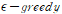  알고리즘

- 다음 선택을 할 때 e-의 확률로 랜덤하게 결정

- 위에서 언급한 경험하지 못한 변수들을 만나볼 기회를 제공

#### 4.1.2.2 상계방법

- 각 행동의 상계를 U, 기대 보상이 Q, 단측 신뢰구간을 C라고 할 때

  ​	  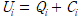  

  식이 성립

- 해당 행동을 방문하면 C값이 작아지므로 가보지 않은 곳에 대한 프리미엄을 제공하는 개념

### 4.1.3 강화학습의 어려움

- 기여도 배정 문제
  - 어떤 선택이 최종 결과에 얼마나 영향을 줬는지 구성 어려움
- 선택할 수 있는 상태가 매우 많을 수 있음
  - 기존 MDP에서 행렬이 엄청 커질 수 있는 문제
  - 신경망 모형을 사용하여 해결하고자 함
- 특정 선택에 따라 달라지는(고려하지 못하는) 경우 존재
- 실현문제(로봇, 자율주행 등)

## 4.2 가치기반 학습

### 4.2.1 상태-행동 쌍

#### 4.2.1.1 Q-Learning

- 대표적인 off-policy 

- 행동 선택시 quality라고 불리는  Q( )함수를 최대화 하는 값을 선택해 나가는 전략
  -   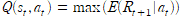 로 정의되며 행동 선택시 누적 보상
- 신경망 모형은 해당 값을 추정하는데 사용(출력이 Q( )값)
  -   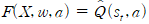 ,즉 가치를 출력하고 최대 값 선택  

- 모든 과정을 한 번에 확인할 수 없으므로 대용 관측값(surrogate) 사용

  - 이 때 사용되는 직관은 '미래에 대한 부분 지식을 사용하여 Q값을 개선 가능하다면 실제 Q값이 없어도 개선 가능'
  - surrogate는 벨만방정식을 기반으로 결정
    -   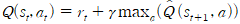 이므로 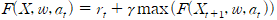 
    -   위 값을 상수인 관측치로 가정하고 손실계산

- 훈련과정

  1. X_t+1 을 순전파하여 max(F(X, w, a))값을 계산 ~ y_true값으로 사용
  2. X_t 를 순전파하여 y_pred값 산출
  3. 오차 및 목적함수 계산 후 역전파

  ** 마지막 경우인 경우 Q 값은 0으로 설정(벨만 방정식)

  **  방식을 사용하여 탐색과정 추가

** 경험재현, 경험역사 등의 개념을 활용하여 학습 강화

#### 4.2.1.2 SARSA

- State - Action - Reward - Action - State의 줄임말(..)
- 대표적인 on-policy
- q-러닝과 달리 다음 단계의 최적보상을 선택하지 않음
- 대신 다음 단계에서도 같은  알고리즘을 사용하여 다음 기 action결정
- 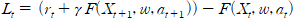 로 설정하고 역전파 알고리즘으로 신경망 가중치 갱신
- epsilon이 0이면 q-러닝과 일치

#### 4.2.1.3 근사기 없는 학습

- 상태공간이 작은 경우에만 적용 가능
- 모든 경우에 대해서 Q( ) 값을 직접 계산 후
- array등으로 관리

#### 4.2.1.4 상태자체 학습

- 상태-동작 쌍을 명확히 표현하지 못하는 경우 유용한 방법
- 신경망의 출력이 상태의 자치 그 자체
- 해당하는 신경망을 G( )라 할 때  
- 훈련 과정은 q-러닝에서 처럼 대용변수를 사용하여 진행
  - 즉  값을 관측치로 loss계산  

### 4.2.2 TD 알고리즘

- **시간차 학습**(Temporal difference learning)은 예측 기반 [기계 학습](https://ko.wikipedia.org/wiki/기계_학습)의 한 방법이다. 시간차 학습은 주로 [강화 학습](https://ko.wikipedia.org/wiki/강화_학습) 문제에 사용되며, "[몬테카를로 방법](https://ko.wikipedia.org/wiki/몬테카를로_방법)과 [동적 계획법](https://ko.wikipedia.org/wiki/동적_계획법)의 조합"이라고 불리기도 한다.[[1\]](https://ko.wikipedia.org/wiki/시간차_학습#cite_note-RSutton-1998-1) 이는 시간차 학습이 어떤 정책에 따라 환경을 [표집](https://ko.wikipedia.org/wiki/표집)하여 학습을 진행하는 몬테 카를로 방법의 특징과, 과거에 학습한 추정치를 사용하여 현재의 추정치를 구하는 동적 계획법의 특징을 지니고 있기 때문이다.(위키 일부)

- 위에서 살펴본 q-러닝 등이 이에 해당(한 기 앞자료를 사용)
  - 과거 값에 대한 교정이 없으므로 TD(0)에 해당하는 근시안적 방법
- 해당 과정에서 문제점은 과거의 잘못된 선택이 영향을 줘 오차가 잘못될 수 있음
- 이를 교정하기 위해서 일정 비율(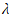)로 과거 선택을 반영
  -   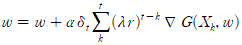 
- lambda = 1이면 과거 예측을 완전 수정

### 4.2.3 정책기울기 법

- 해당 방법에서는 각 동작의 확률을 추정(이 전에는 각 해동의 가치를 추정)
- 정책자체가 매개변수로 작용
- 사용되는 신경망을 policy-network 라고 명명
  - 해당 망은 확률을 추정해야 하므로 마지막 출력층에 softmax함수 사용
- 해당 망에서 나온 출력을 기반으로 다음 상태 결정 => 보상관측 (=> 갱신)
  - 위 과정에서 다음 단계에 해당하는 보상이 없을 수 있음(체스의 경우 게임이 끝나야 보상 획득)
  - 그렇기 때문에 끝날 때까지 모의 실험해서 보상 도출
    - 목적함수 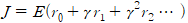 로 결정
    - 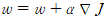 로 갱신
  - 문제는 신경망출력은 확률값이므로 기울기 계산 불가
    - 유한차분법, 가능도비법 등을 사용

#### 4.2.3.1 유한차분법

- 확률값 문제를 실험적 모의 실험을 통해 보상기울기 추정
- 가중치 섭동기법 사용

- 절차
  1. H(horizontal; 끝)까지 단계별 rollout(신경망모형을 실행하는 단계를 의미)실행
  2. 변화량 섭동 벡터 (w), 보상변화량(J) 생성
  3. 행렬 D생성, where D는 행이 w, 열이 N(신경망 층수)인 행렬
  4. 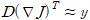  이므로 선형회귀 적용하여 기울기값 구함
  5. 즉 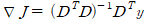로 결정 
  6. 위 갱신식에 사용 

#### 4.2.3.2 가능도비법

- 목표: 정책 p를 따라서 E(Q(s, a)최대화 => 해당 값에 기초한 경사상승 사용

  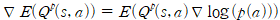, where p(a)는 신경망의 출력(확률) 

-  절차(위 과정)
  1. Q(s, a)결정 : 모의 실행을 통한 장기보상
  2. log(p(a))의 기울기를 구하고 장기보상과 곱

** 설명이 부족해서 이해 잘 안된 부분

** 행위자-비평자 모형, 기준가치를 이용한 분산감소 파트는 위 먼저 이해하고 정리예정