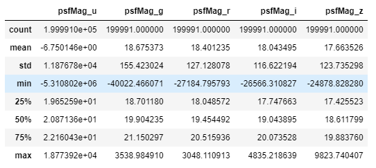
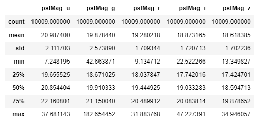

# COSMIC_CLF

- Public score: 0.35951 (62/682)
- Total score: 44/690
- 5% 까지 갔었는데 아쉬움 + 역시 feature engineering을 잘해야함
  - 특별한 eda없이 5%까지 간것은 자체로도 놀라운 경험이긴 하였음

## 1. Feature Engineering

- have no idea about cosmic data, almost nothing to change
- try only square and log and sum some categories

### 1) Outlier

- it seems to have some outliers
- one can find some very small or large points but quantile is not that different

train_set



test_set



- I have no much acknowledge about data, if any have smaller than test or bigger than test is cut

```python
list(m[c][m[c].map(lambda x: x if mini < x < maxi else 'c') == 'c'].index.values)
```

### 2) Scaler

- I use MinMax, Normalizing, Robust scaling, and robust scaling give best result

```python
trf = RobustScaler().fit(tr[c].values.reshape(-1, 1))
tr[c] = trf.transform(tr[c].values.reshape(-1, 1))
te[c] = trf.transform(te[c].values.reshape(-1, 1))
```

### 3) ETC

- I add some transformation
  - PCA
  - Clustering
- PCA for data manipulation
- Clustering for pseudo labeling
  - KMean, GMM, DEC

## 2. Modeling

- Try several model for test
- Data is imbalanced, so tree methods give better score

- Especially I use LightGBM as my baseline model just for my convenience

### 1) Ensemble

- For this case, ensembling several models seems to overfit

- Stack
  - rf + lgb + xgb
  - seems to overfit
- Voting
  - cat + lgb + xgb + rf
- NN_stacking
  - meta data from lgb and xgb
