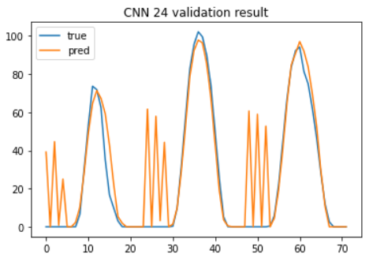

# OIBC 대회 리뷰

-   한 달 정도 진행되었던 대회에 참여했던 내용을 리뷰
-   다른 일로 바빠서 이것 저것 시도해보지 못한 내용이 아쉬웠던 대회였다.
-   시즌1에서는 날씨 데이터를 사용하지 않고 단일데이터를 사용
-   시즌2에서는 3시간 단위 날씨 예측정보를 사용하여 모델링 진행

# 0. Summary

-   초반 마스킹 값을 복원하는 내용에서는 날씨 정보만 사용하였다.
-   지역을 고려하여 주위 3군데 날씨 정보를 사용하여 트리기반 모형을 구성하여 상당히 높은 점수를 기록하였다.
-   그러나 예측에 활용하려다보니 이틀 전 데이터까지만 사용할 수 있어 중반 이후 부터는 다른 방식을 사용하였다.
-   이 후에는 단일 변수 시계열로 접근하였다.
    -   1-step ahead와 24시간 예측을 비교하였고 24시간을 한 번에 예측하는 것이 더 안정적인 성능을 보여주었다.
    -   여기서 CNN, RNN 등 구조를 사용하였고, 이를 결합하여 LSTNET과 유사한 네트워크를 사용하였다.
        -   여기서 한 큰 네트워크 안에 서브네트워크와 이를 결합하는 층을 추가하여 앙상블 효과를 기대하여 사용하였다.(다른 대회에서 사용한 테크닉)
    -   최근 GAN을 활용한  시퀀스 데이터에 대한 연구를 보고 있어서 이를 적용해보았다.
        -   나름 좋은 성과를 내었고 이를 최종 모형으로 제출하였다.

# 1. Preprocessing

-   날씨 정보를 활용하지 않기로 하였으므로 전처리 과정은 단순하다.

-   최대값이 113으로 안내받았으므로 이를 활용하여 0~113 사이에 값으로 scaling해주었다.
-   이 후 윈도우를 24로 설정하였다.
    -   개념적으로 전 날의 값을 활용
    -   24, 48 등의 값을 비교해본 결과이며, 24정도가 적당하다고 생각하여 사용

# 2. Modeling

-   constraints GAN을 기반으로 하여 wasserstein GAN기반 최적화하는 모형을 구성하였다.
-   지난 24시간의 정보를 constraint로 활용하였고,
-   latent vector의 크기는 8로 설정하였다.
    -   의도적으로 latent size를 줄여서 지난 기간의 정보를 더 활용하고자 의도하였다.
-   예측이 목적이므로 100번 랜덤 노이즈를 뽑아서 타겟값을 생성하여 평균 값을 예측 값으로 사용하였다.
-   generator의 끝 단에는 linear/sigmoid를 적용하여 보았지만 큰 차이가 나지 않아 linear를 사용하였고 목적에 맞게 clip해주었다.
-   결과를 보면 나름 잘 찾아가는 것을 확인할 수있다.

-   특히 LSTNet과 비교해보면 보다 dynamics를 잘 이해하는 결과를 보여주어 인상적이었다.

# 3. Outtro

-   결과는 시간을 많이 투자하지 못한 만큼 아쉬운 성적을 보여주었다.
-   분포를 예측한다는 접근으로 참가했는데 다른 팀들보다 사용한 변수가 많지 않아서 큰 성능을 기대하기 힘들었던 것 같다.